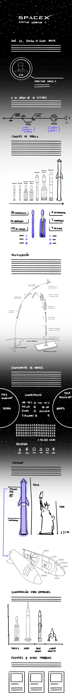

# Clase-14

### Boceto definido en la Evaluación #3

### Título: 

Un recorrido por Space X

### Subtítulo:

La empresa de fabricación aeroespacial del magnate Elon Musk

### Bajada:

En esta inforgafía se hará un recorrido por la estrategia de recuperación de naves de SpaceX y su objetvo final de colonización de Marte. 

### Contexto "histórico": 

Dentro de lo privado. Primeras competencias rusas que llevaban personas al espacio. 
